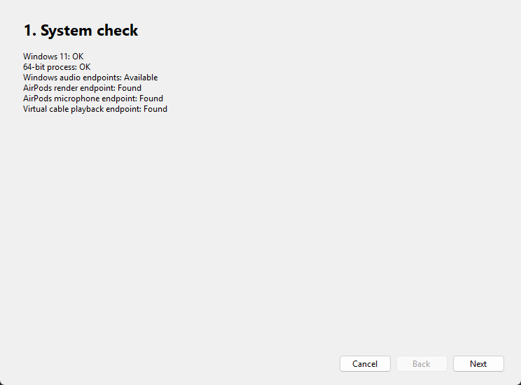
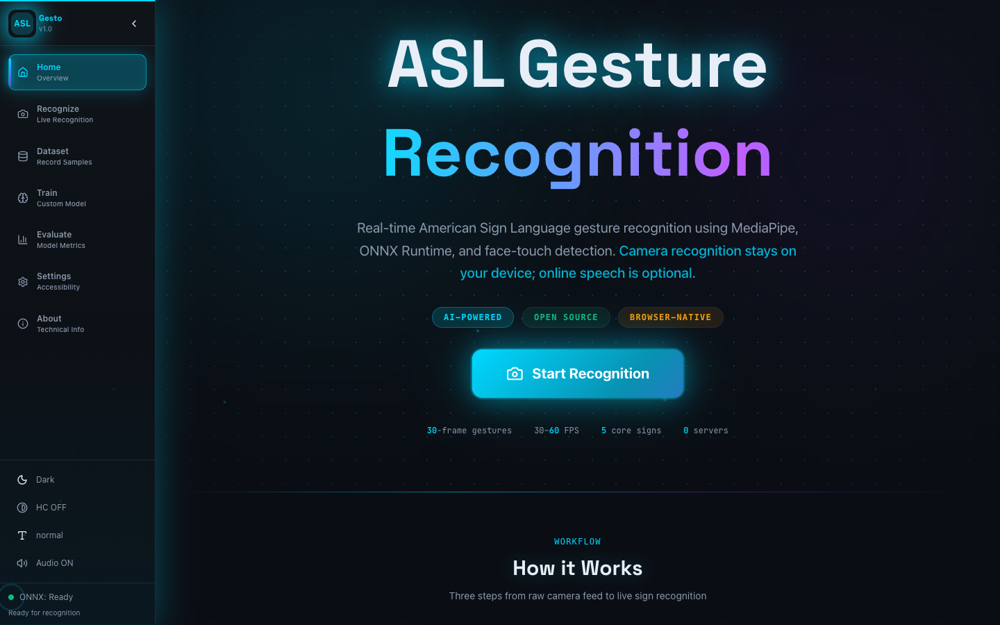
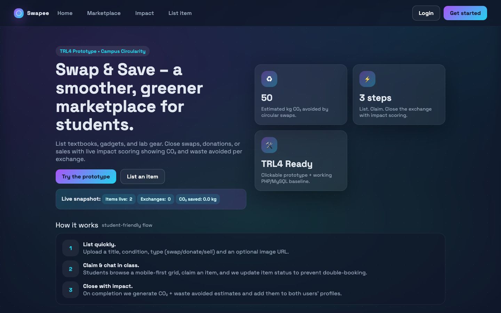
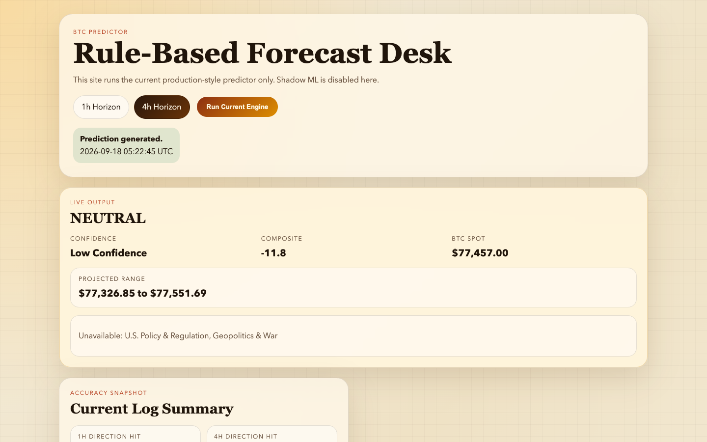
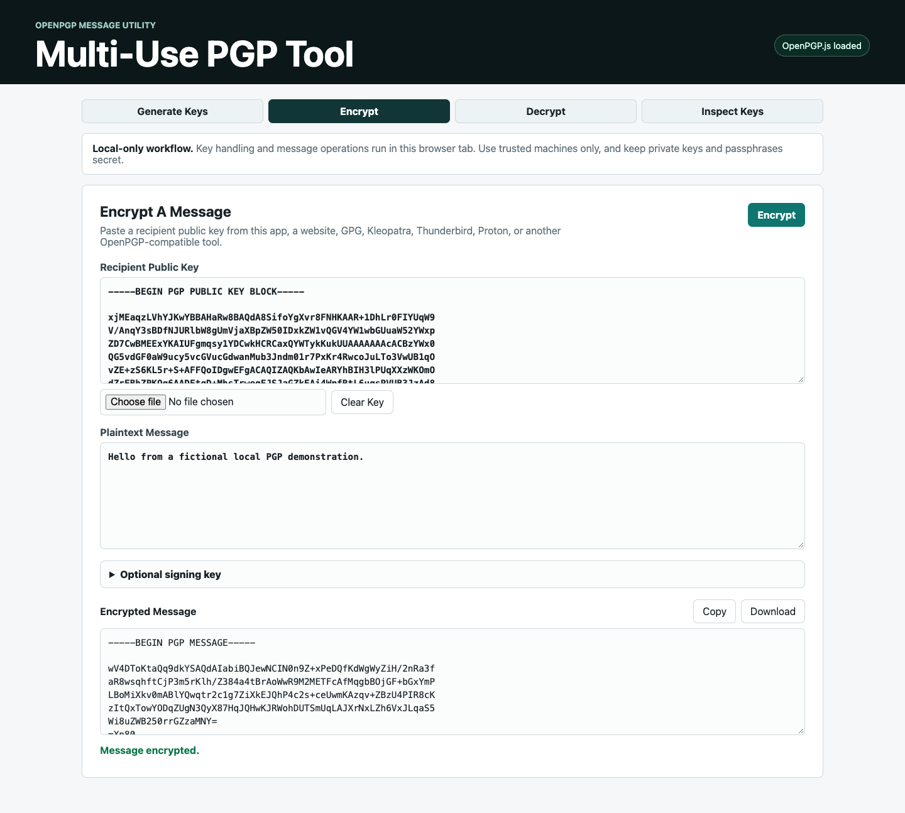
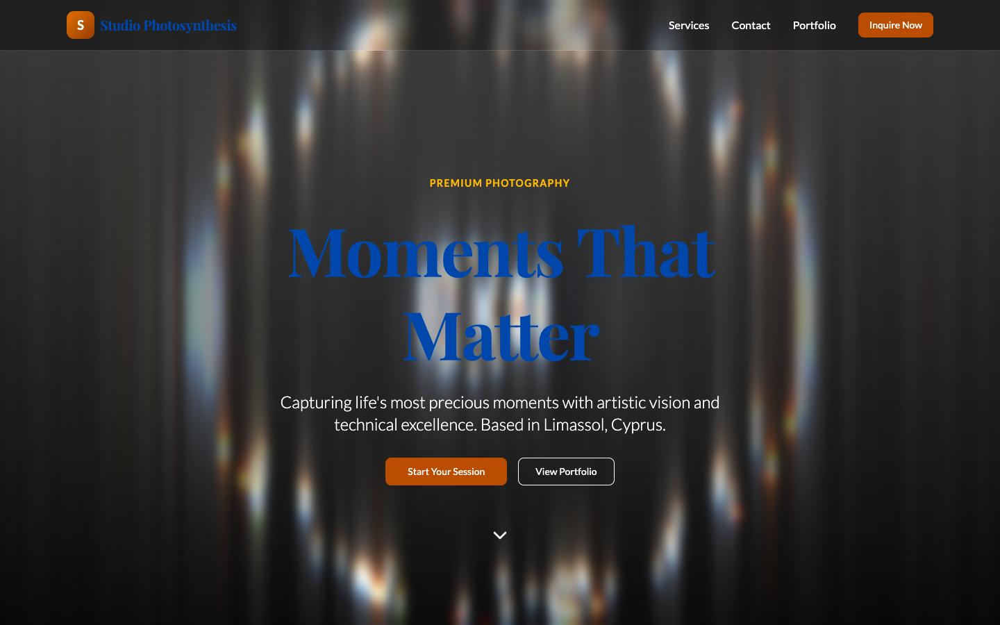
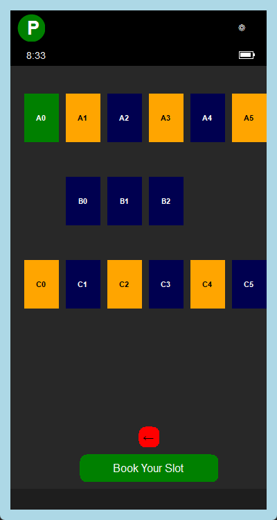
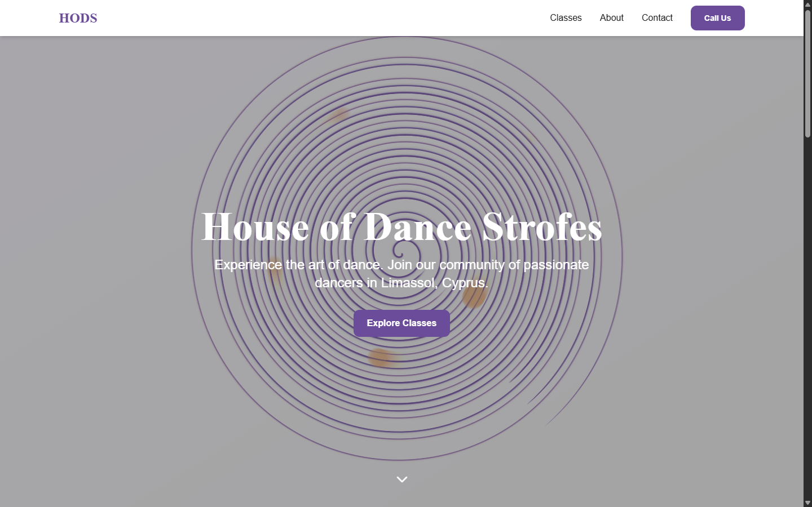
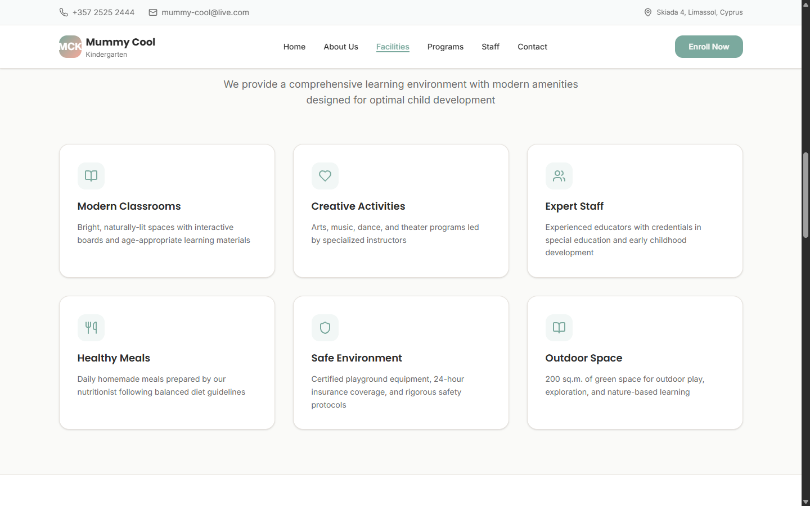

<p align="center">
  
</p>

<p align="center">
  <a href="https://git.io/typing-svg">
    
  </a>
</p>

<p align="center">
  <a href="https://github.com/MakeItEzzz555?tab=followers">
    
  </a>
  
</p>

---

## 👾 About Me

I'm a Computer Science student who likes building across multiple layers of software instead of staying inside one stack.

My projects range from **full-stack platforms and AI/ML experiments** to **native desktop apps, systems work, game development, creative coding, cryptography tools, and automation**.

I enjoy taking an idea from:

**concept → architecture → implementation → debugging → something you can actually use.**

```text
focus       → product engineering, AI/ML, full-stack, desktop & systems
approach    → learn by building
interests   → useful tools, experimental interfaces, automation & creative tech
philosophy  → ship it, break it, understand it, improve it
```

---

## ⚡ Technologies I've Worked With

### Languages

<p align="center">
  
</p>

### Frameworks & Platforms

<p align="center">
  
</p>

### Tools

<p align="center">
  
</p>

<p align="center">
  
  
  
  
  
  
</p>

---

## 🚀 Featured Projects

### 🔮 PredictX

**Full-stack prediction-market platform** with Yes/No contracts, live order books and price feeds, portfolio tracking, Stripe-backed deposits, market categories and an AI chat assistant.

<p>
  <a href="https://github.com/MakeItEzzz555/predictx"></a>
  
  
  
  
</p>

### 🎧 AirPTTBridge

**Windows 11 push-to-talk audio bridge** that opens the physical AirPods microphone only while the configured PTT key is held, routes live audio through a virtual cable, and releases the capture endpoint after key-up.

<p align="center">
  <a href="https://github.com/MakeItEzzz555/AirPTTBridge">
    
  </a>
</p>

<p align="center">
  
  
  
</p>

### 🎬 Project Gallery

<table>
<tr>
<td width="50%" valign="top">
<h3 align="center">🤟 SignAI</h3>
<a href="https://github.com/MakeItEzzz555/signai-asl-gesture-demo"></a>
<p align="center"><strong>Browser-based ASL gesture recognition</strong><br>MediaPipe · ONNX Runtime Web · TensorFlow.js · TypeScript</p>
</td>
<td width="50%" valign="top">
<h3 align="center">🧑‍🏫 SkillShare Local</h3>
<a href="https://github.com/MakeItEzzz555/skillshare-local"></a>
<p align="center"><strong>Role-based learning-session platform</strong><br>PHP · MySQL · Sessions · Bookings · Ratings</p>
</td>
</tr>
<tr>
<td width="50%" valign="top">
<h3 align="center">♻️ Swapee</h3>
<a href="https://github.com/MakeItEzzz555/swapee-reuse-marketplace"></a>
<p align="center"><strong>Swap, donate and sell marketplace prototype</strong><br>PHP · MySQL · Listings · Transactions · Impact profiles</p>
</td>
<td width="50%" valign="top">
<h3 align="center">₿ BTC Price Prediction</h3>
<a href="https://github.com/MakeItEzzz555/BTC-Price-Prediction"></a>
<p align="center"><strong>Rule-based market-signal forecast dashboard</strong><br>Python · Flask · CoinGecko · yfinance</p>
</td>
</tr>
<tr>
<td width="50%" valign="top">
<h3 align="center">🔐 Browser PGP Tool</h3>
<a href="https://github.com/MakeItEzzz555/browser-pgp-tool"></a>
<p align="center"><strong>Browser-only OpenPGP utility</strong><br>JavaScript · OpenPGP.js · Encryption · Signing · Verification</p>
</td>
<td width="50%" valign="top">
<h3 align="center">⚛️ Particle Physics</h3>
<a href="https://github.com/MakeItEzzz555/browser-particle-physics"></a>
<p align="center"><strong>Interactive browser physics experiment</strong><br>Three.js · JavaScript · Simulation · Creative coding</p>
</td>
</tr>
<tr>
<td width="50%" valign="top">
<h3 align="center">📸 Studio Photosynthesis</h3>
<a href="https://github.com/MakeItEzzz555/studio-photosynthesis-web"></a>
<p align="center"><strong>Cinematic photography studio website</strong><br>React · TypeScript · Tailwind CSS · Framer Motion</p>
</td>
<td width="50%" valign="top">
<h3 align="center">✨ Pygame Particle Layers</h3>
<a href="https://github.com/MakeItEzzz555/pygame-particle-layers"></a>
<p align="center"><strong>Layered particle animation experiment</strong><br>Python · Pygame · Visual effects · Creative coding</p>
</td>
</tr>
</table>

<details>
<summary><strong>🧩 More Builds & Prototypes</strong></summary>
<br>

<table>
<tr>
<td width="50%" valign="top">
<h3 align="center">🚗 Open Roads</h3>
<a href="https://github.com/MakeItEzzz555/open-roads-driving-demo"></a>
<p align="center"><strong>Browser driving experiment</strong><br>3D scene · vehicle controls · interactive prototype</p>
</td>
<td width="50%" valign="top">
<h3 align="center">🅿️ Smart Parking</h3>
<a href="https://github.com/MakeItEzzz555/smart-parking-prototype"></a>
<p align="center"><strong>Parking-slot booking prototype</strong><br>Interactive UI · availability states · booking flow</p>
</td>
</tr>
<tr>
<td width="50%" valign="top">
<h3 align="center">💃 House of Dance Strofes</h3>
<a href="https://github.com/MakeItEzzz555/house-of-dance-strofes"></a>
<p align="center"><strong>Modern dance-school website</strong><br>Responsive web design · branded landing experience</p>
</td>
<td width="50%" valign="top">
<h3 align="center">🧸 Mummy Cool Kindergarten</h3>
<a href="https://github.com/MakeItEzzz555/mummy-cool-kindergarten-modernized"></a>
<p align="center"><strong>Modernized kindergarten website</strong><br>Responsive UI · information architecture · service pages</p>
</td>
</tr>
</table>

</details>

---

## 🧠 What I Build

| Area                      | Some of my work                                                              |
| ------------------------- | ---------------------------------------------------------------------------- |
| 🤖 **AI / ML**            | SignAI ASL gesture recognition, ONNX inference, MediaPipe pipelines          |
| 🌐 **Full-Stack Web**     | PredictX, SkillShare Local, Swapee, React / Next.js applications             |
| 🖥️ **Desktop & Systems** | AirPTTBridge, Java/JavaFX apps, C/C++, Bash/Unix coursework                  |
| 🎮 **Games & Graphics**   | Unity development, Three.js experiments, Pygame and browser particle systems |
| 🔐 **Security / Tools**   | Browser OpenPGP utility, archive risk scanner                                |
| 📊 **Data / Prediction**  | BTC Price Prediction, SQL/MySQL projects and data-driven applications        |

---

## 🎓 Computer Science Archive

<p align="center">
  <a href="https://github.com/MakeItEzzz555/frederick-university-coursework"></a>
</p>

<p align="center">
  
  
</p>

The archive consolidates smaller labs, tutorials, revision exercises and exam practice across programming fundamentals, operating systems, system programming, web development, Python, Java, data structures, UNIX shell work and MIPS assembly. Substantial applications stay in their own repositories.

---

## 📈 GitHub Activity

<p align="center">
  
</p>

<p align="center"><sub>Project previews above are stored directly in this profile repository for reliable rendering.</sub></p>

---

## 🌌 Beyond the Pins

There's more throughout the profile — web experiments, desktop applications, university projects, simulations, creative coding, automation, and older work preserved as part of the journey.

<p align="center">
  <a href="https://github.com/MakeItEzzz555?tab=repositories">
    
  </a>
</p>

---

<h3 align="center">
  Build things. Understand them. Make the next version better.
</h3>

<p align="center">
  
</p>
