

  

  
  

  <a href="https://github.com/MakeItEzzz555?tab=repositories"><strong>Repositories</strong></a>
  &nbsp;·&nbsp;
  <a href="https://github.com/MakeItEzzz555/frederick-university-coursework"><strong>Coursework</strong></a>
  &nbsp;·&nbsp;
  <a href="https://github.com/MakeItEzzz555?tab=followers"><strong>Follow</strong></a>

 

  

<strong>TOOLCHAIN SIGNALS</strong> // languages · frameworks · native · systems · ML · creative tooling

&nbsp;&nbsp;&nbsp;&nbsp;&nbsp;&nbsp;&nbsp;&nbsp;&nbsp;&nbsp;&nbsp;&nbsp;&nbsp;&nbsp;&nbsp;&nbsp;&nbsp;&nbsp;&nbsp;&nbsp;&nbsp;&nbsp;&nbsp;&nbsp;

&nbsp;&nbsp;&nbsp;&nbsp;&nbsp;&nbsp;&nbsp;&nbsp;&nbsp;&nbsp;&nbsp;&nbsp;&nbsp;&nbsp;&nbsp;&nbsp;&nbsp;&nbsp;&nbsp;&nbsp;&nbsp;&nbsp;&nbsp;&nbsp;&nbsp;&nbsp;&nbsp;&nbsp;

 

  

  

  

  

  

  

  

 

  

  <a href="https://github.com/MakeItEzzz555/AirPTTBridge">
    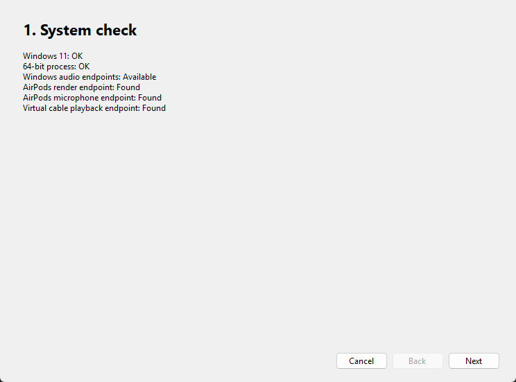
  </a>

<h3 align="center">AirPTTBridge</h3>

<strong>Windows push-to-talk audio bridge</strong> C# · .NET · WASAPI · Windows audio routing

&nbsp;&nbsp;

<table>
<tr>
<td width="50%" valign="top">
<h3 align="center">SignAI / Gesto</h3>
<a href="https://github.com/MakeItEzzz555/signai-asl-gesture-demo">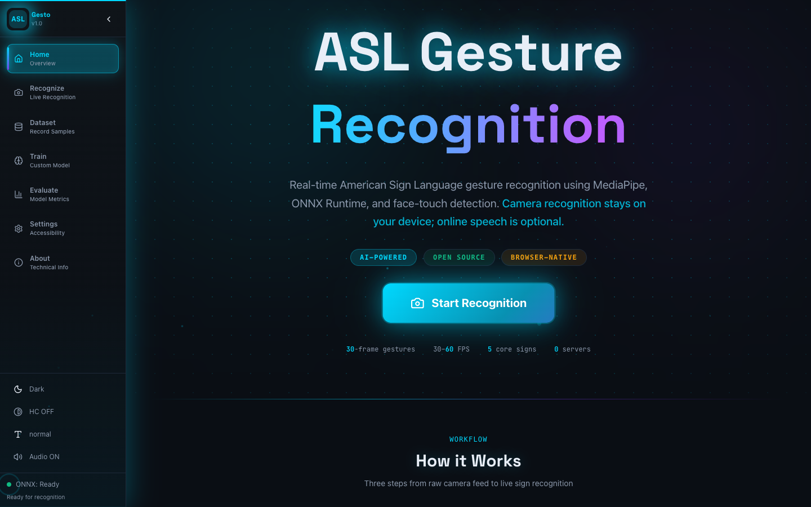</a>

<strong>Browser-based gesture recognition</strong> MediaPipe · ONNX Runtime · TensorFlow.js · TypeScript

&nbsp;&nbsp;

</td>
<td width="50%" valign="top">
<h3 align="center">SkillShare Local</h3>
<a href="https://github.com/MakeItEzzz555/skillshare-local">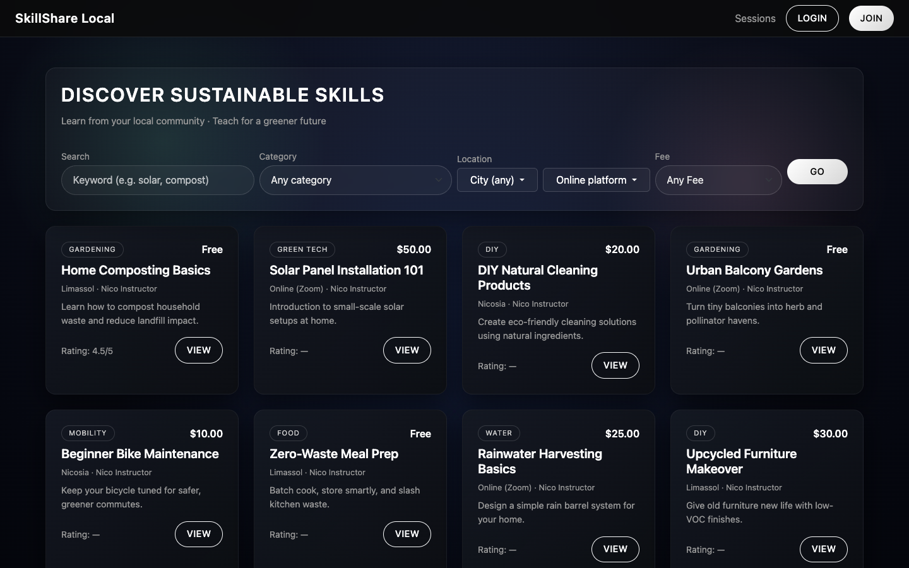</a>

<strong>Role-based learning-session platform</strong> PHP · MySQL · Sessions · Bookings · Ratings

&nbsp;

</td>
</tr>
<tr>
<td width="50%" valign="top">
<h3 align="center">Swapee</h3>
<a href="https://github.com/MakeItEzzz555/swapee-reuse-marketplace">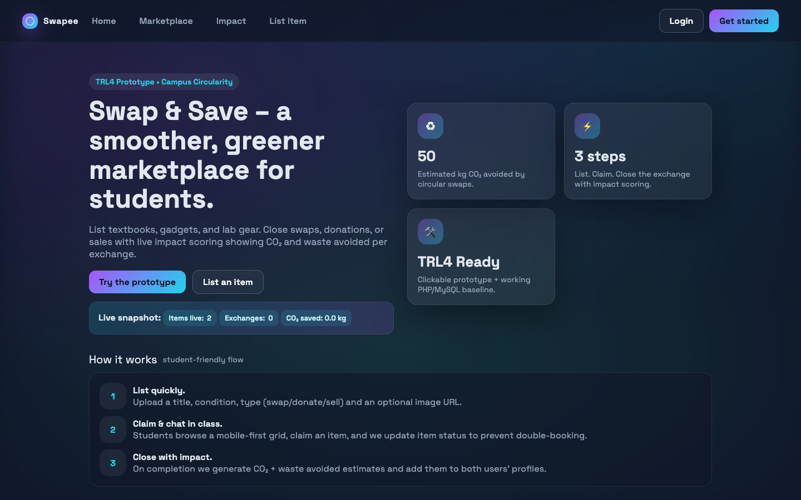</a>

<strong>Swap, donate and resale marketplace</strong> PHP · MySQL · Listings · Transactions · Ratings

&nbsp;

</td>
<td width="50%" valign="top">
<h3 align="center">BTC Price Prediction</h3>
<a href="https://github.com/MakeItEzzz555/BTC-Price-Prediction">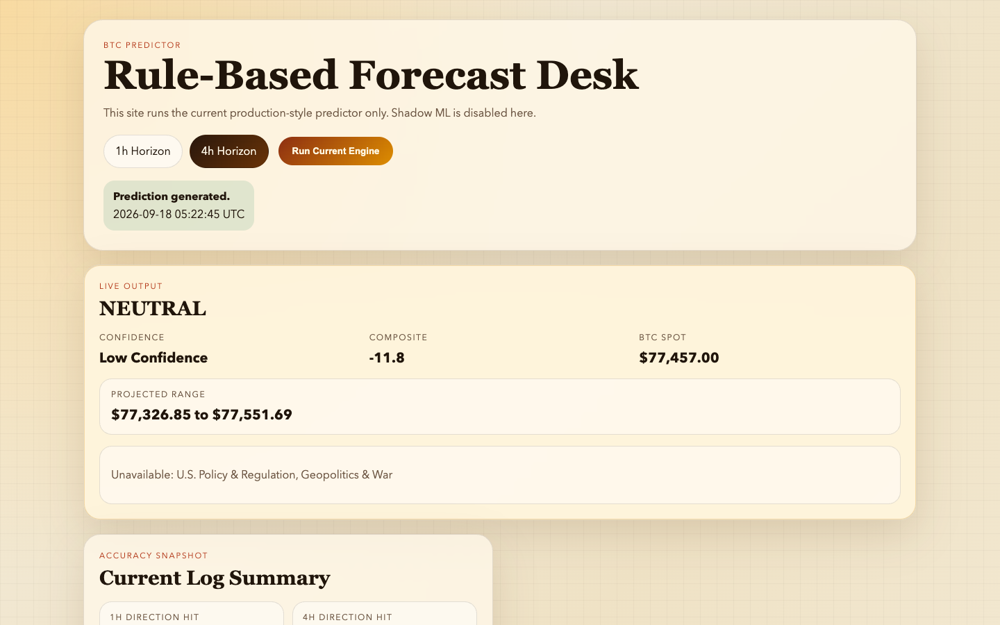</a>

<strong>Market-signal forecast dashboard</strong> Python · Flask · market data APIs

&nbsp;&nbsp;

</td>
</tr>
<tr>
<td width="50%" valign="top">
<h3 align="center">Browser PGP Tool</h3>
<a href="https://github.com/MakeItEzzz555/browser-pgp-tool">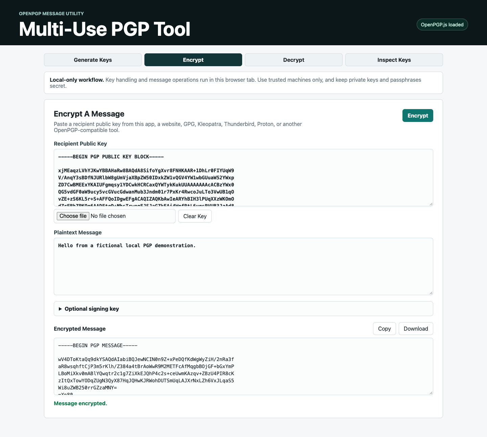</a>

<strong>Browser-only OpenPGP utility</strong> JavaScript · encryption · signing · verification

</td>
<td width="50%" valign="top">
<h3 align="center">Particle Physics</h3>
<a href="https://github.com/MakeItEzzz555/browser-particle-physics">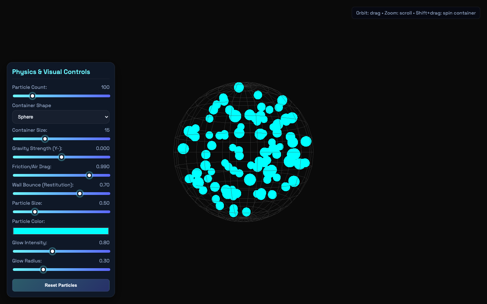</a>

<strong>Interactive browser physics experiment</strong> Three.js · JavaScript · simulation · creative coding

&nbsp;

</td>
</tr>
<tr>
<td width="50%" valign="top">
<h3 align="center">Studio Photosynthesis</h3>
<a href="https://github.com/MakeItEzzz555/studio-photosynthesis-web">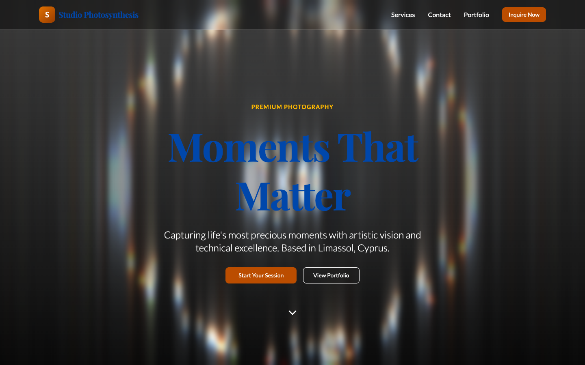</a>

<strong>Cinematic photography studio website</strong> React · TypeScript · Tailwind CSS · motion

&nbsp;&nbsp;

</td>
<td width="50%" valign="top">
<h3 align="center">Pygame Particle Layers</h3>
<a href="https://github.com/MakeItEzzz555/pygame-particle-layers">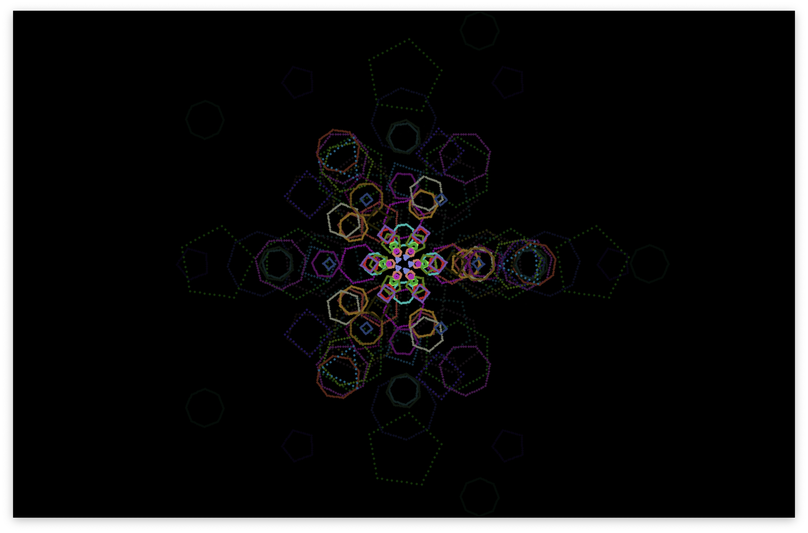</a>

<strong>Layered particle-animation experiment</strong> Python · Pygame · visual effects · creative coding

</td>
</tr>
<tr>
<td width="50%" valign="top">
<h3 align="center">Open Roads</h3>
<a href="https://github.com/MakeItEzzz555/open-roads-driving-demo">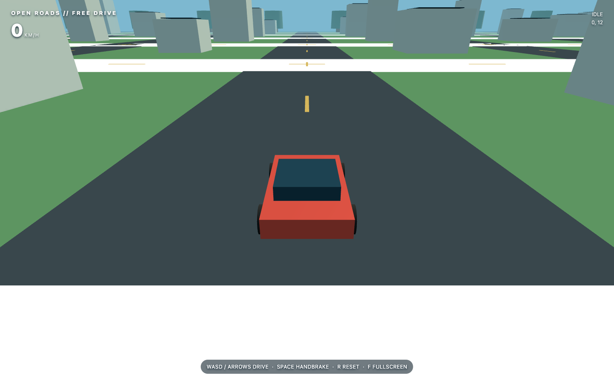</a>

<strong>Browser driving experiment</strong> 3D scene · vehicle controls · interactive prototype

</td>
<td width="50%" valign="top">
<h3 align="center">Smart Parking</h3>
<a href="https://github.com/MakeItEzzz555/smart-parking-prototype">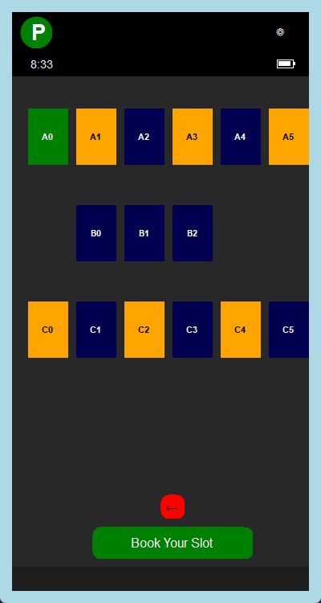</a>

<strong>Parking-slot booking prototype</strong> Interactive UI · availability states · booking flow

&nbsp;&nbsp;

</td>
</tr>
<tr>
<td width="50%" valign="top">
<h3 align="center">House of Dance Strofes</h3>
<a href="https://github.com/MakeItEzzz555/house-of-dance-strofes">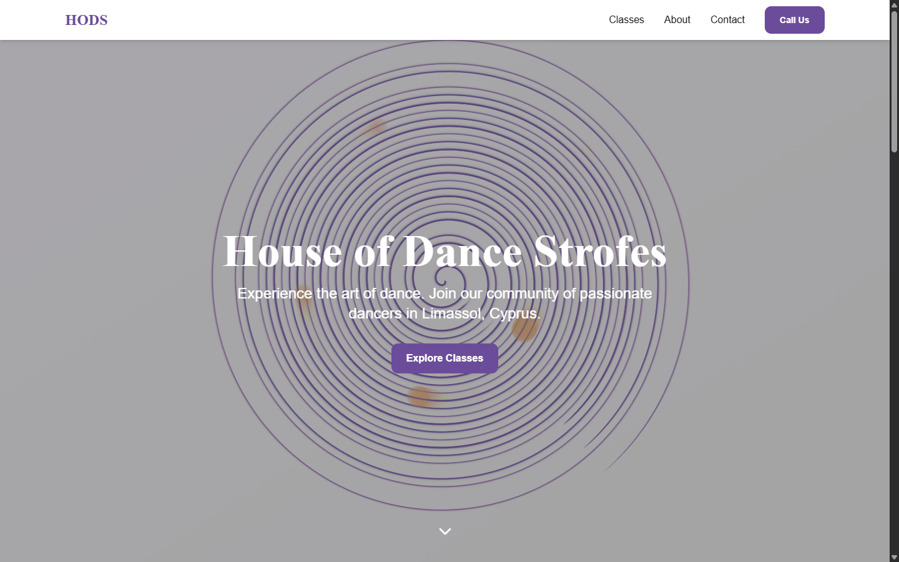</a>

<strong>Modern dance-school website</strong> Responsive web design · branded landing experience

&nbsp;&nbsp;

</td>
<td width="50%" valign="top">
<h3 align="center">Mummy Cool Kindergarten</h3>
<a href="https://github.com/MakeItEzzz555/mummy-cool-kindergarten-modernized">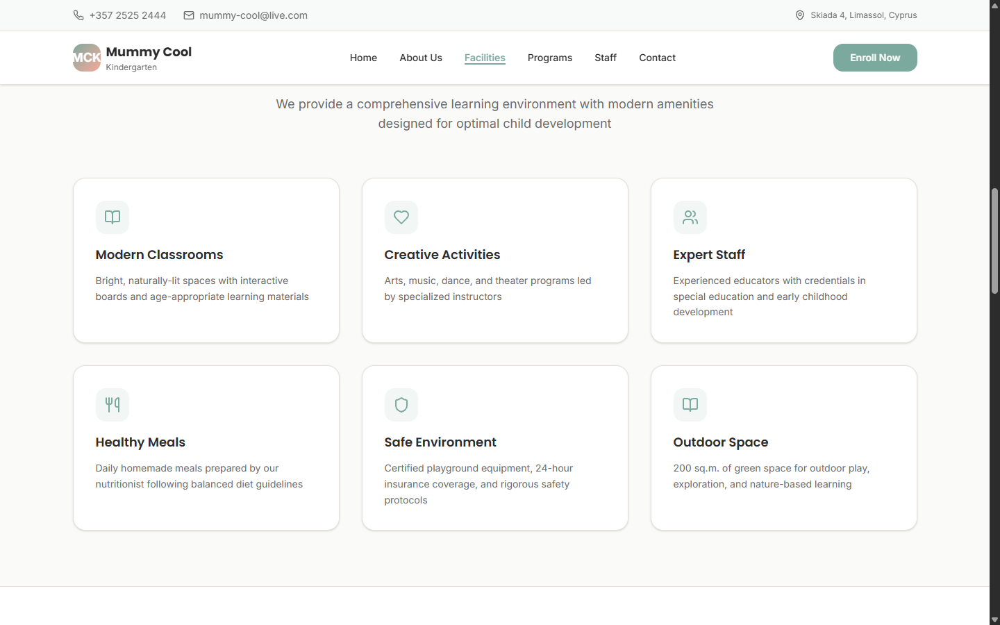</a>

<strong>Modernized kindergarten website</strong> Responsive UI · information architecture · service pages

&nbsp;&nbsp;

</td>
</tr>
</table>

  Visual archive shows every project screenshot currently stored directly in this profile repository. Additional builds without captured screenshots remain represented in the Project Ecosystem above.

 

  
  

  

