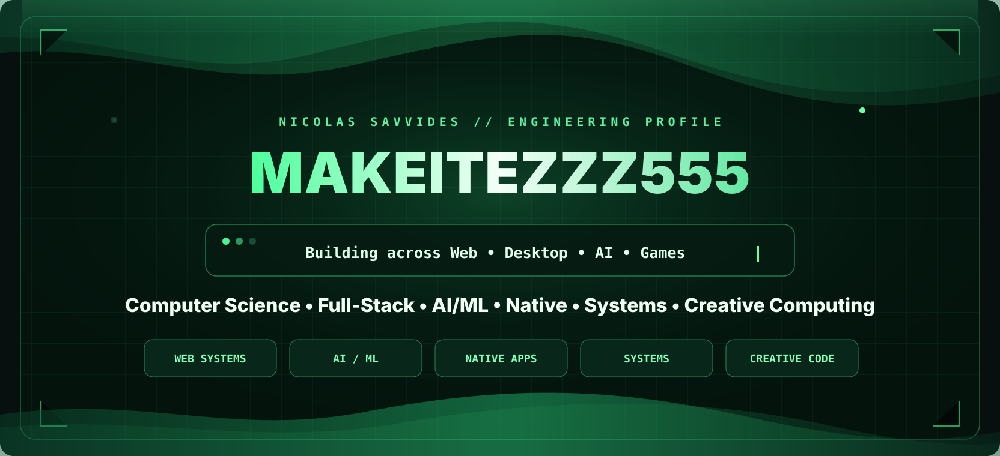
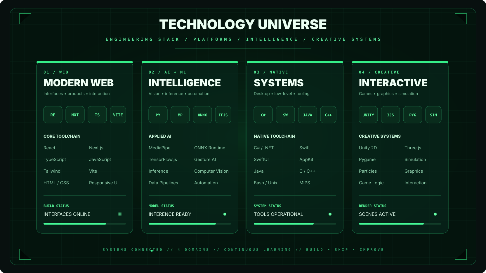
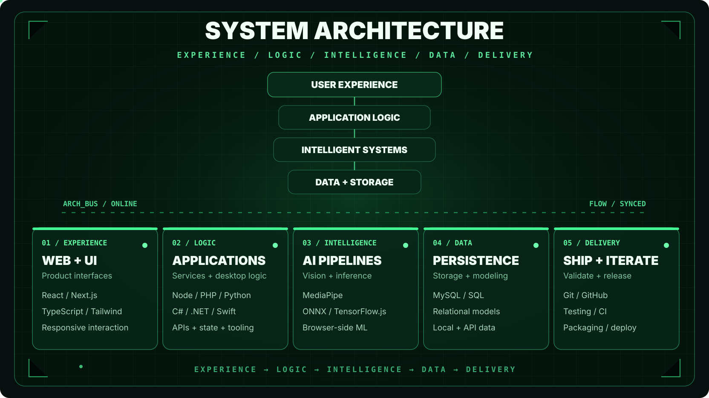
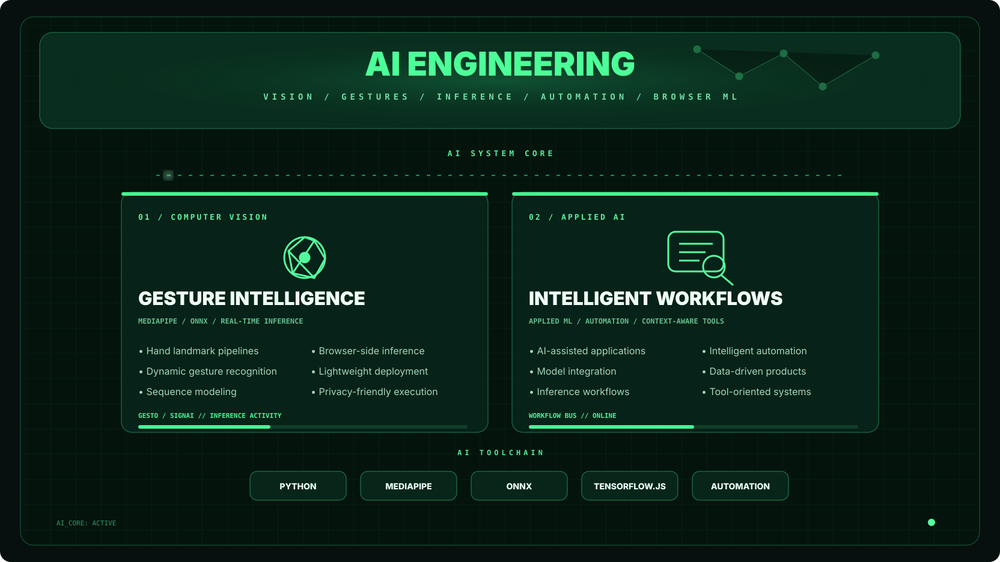
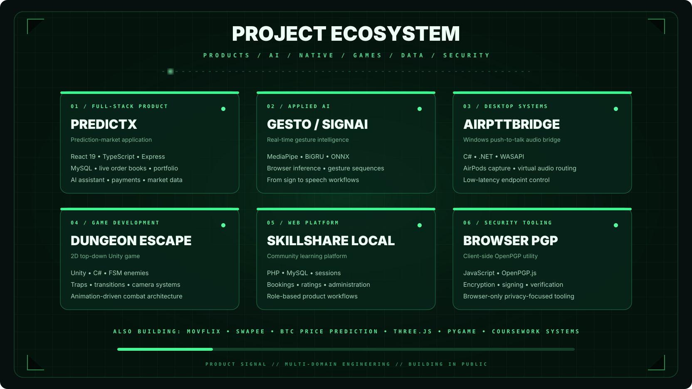
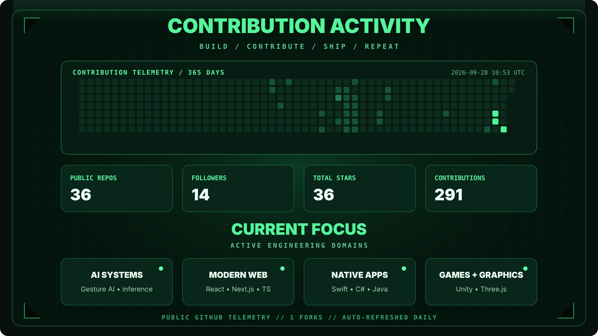
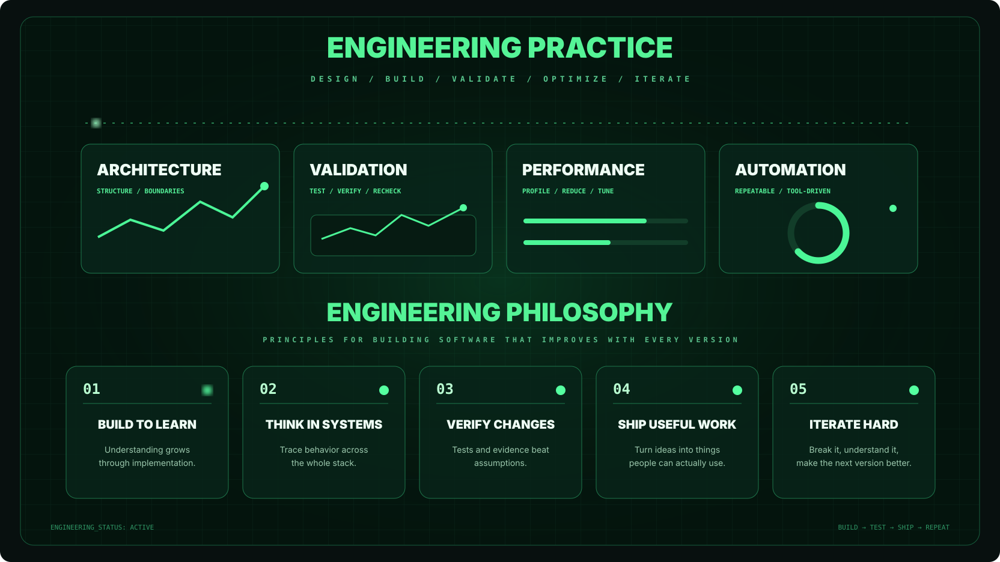

  

  <strong>Computer Science · Full-Stack · AI/ML · Native · Systems · Creative Computing</strong>

  <a href="https://github.com/MakeItEzzz555?tab=repositories">Repositories</a>
  &nbsp;·&nbsp;
  <a href="https://github.com/MakeItEzzz555/frederick-university-coursework">Coursework</a>
  &nbsp;·&nbsp;
  <a href="https://github.com/MakeItEzzz555?tab=followers">Follow</a>

 

  

  

  

  

  

  

<strong>Explore the projects behind the dashboard</strong>

 

- [PredictX](https://github.com/MakeItEzzz555/predictx) — full-stack prediction-market platform
- [Gesto / SignAI](https://github.com/MakeItEzzz555/signai-asl-gesture-demo) — browser-based gesture recognition and inference
- [AirPTTBridge](https://github.com/MakeItEzzz555/AirPTTBridge) — Windows push-to-talk audio bridge
- [Dungeon Escape](https://github.com/MakeItEzzz555/Dungeon_Escape_Project) — Unity 2D game architecture
- [MovFlix](https://github.com/MakeItEzzz555/MovFlix) — modern media-discovery interface
- [SkillShare Local](https://github.com/MakeItEzzz555/skillshare-local) — PHP/MySQL learning-session platform
- [Swapee](https://github.com/MakeItEzzz555/swapee-reuse-marketplace) — swap, donate and resale marketplace
- [Browser PGP](https://github.com/MakeItEzzz555/browser-pgp-tool) — browser-only OpenPGP utility
- [BTC Price Prediction](https://github.com/MakeItEzzz555/BTC-Price-Prediction) — Python/Flask market-signal dashboard
- [Browser Particle Physics](https://github.com/MakeItEzzz555/browser-particle-physics) — Three.js simulation
- [Pygame Particle Layers](https://github.com/MakeItEzzz555/pygame-particle-layers) — Python visual-effects experiment
- [Frederick University Coursework](https://github.com/MakeItEzzz555/frederick-university-coursework) — consolidated Computer Science archive

  GitHub contribution telemetry is regenerated automatically from public GitHub data.

<h3 align="center">Build things. Understand them. Make the next version better.</h3>
